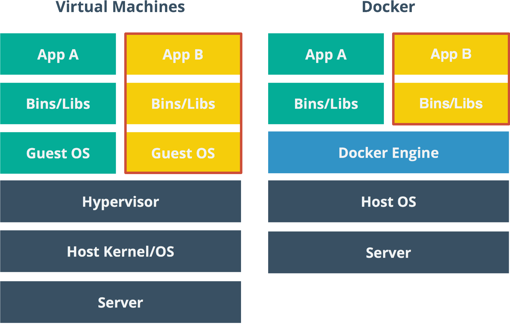
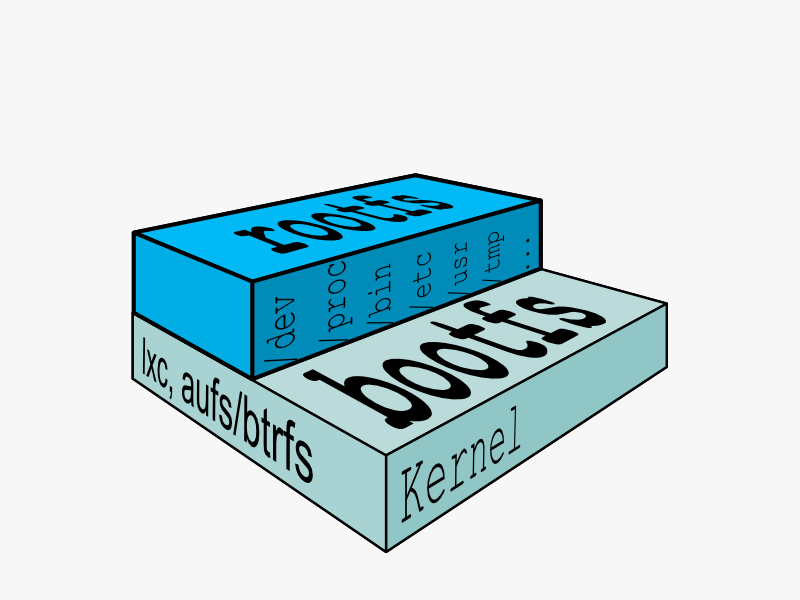
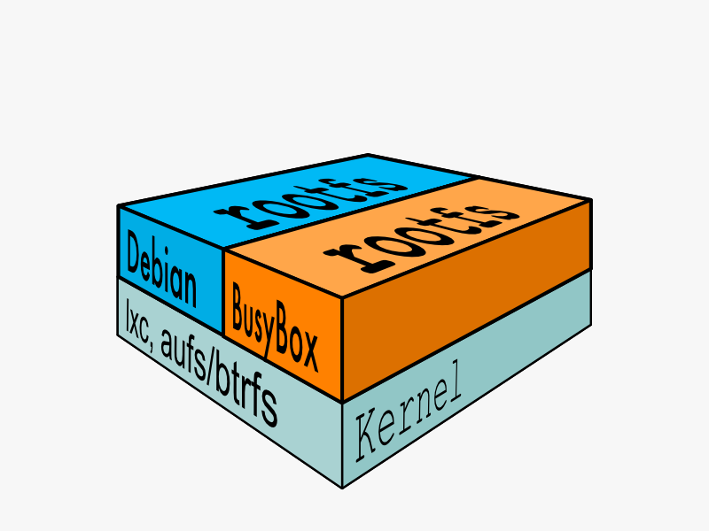
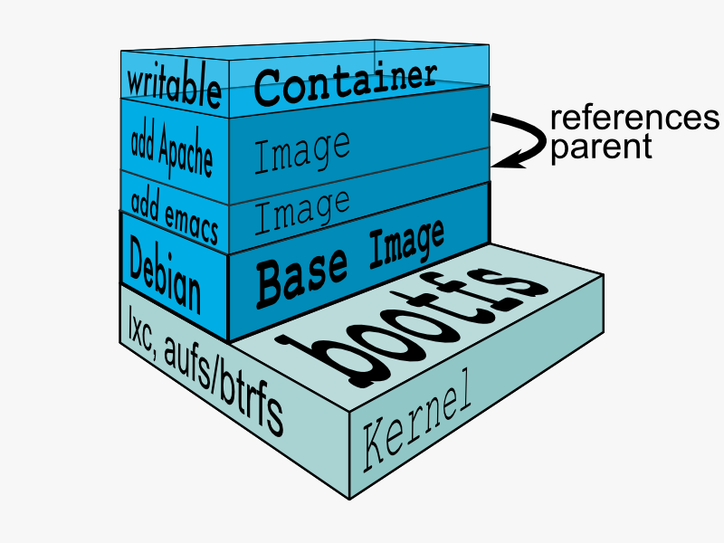
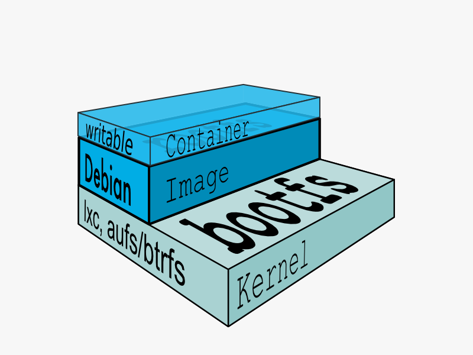
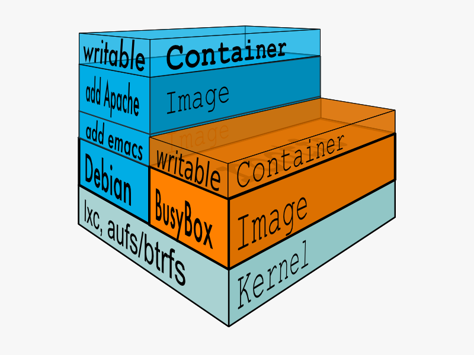

# 1. 容器核心技术概述

当你安装上Docker之后，一定会有这样的认识。Docker就是容器，容器就是Docker。所以只要我们围绕Docker研究它的技术就可以掌握容器技术了。Docker诞生至今已经发展了6年有余，我们翻看Docker的源码演进后发现，Docker软件是新瓶装老酒，通过发起虚拟化2.0革命的口号开始，吸引全球的开发者开始关注容器技术的新趋势和创新能力。放眼当下整个云计算技术设施，不能不佩服Docker开发者的眼光和开源创新能力，通过社区的力量推动了主流云计算大厂投入研发并推动了容器云的业界标准的制定和发展。现在容器技术的发展主要由CNCF，全称Cloud Native Computing Foundation（云原生计算基金会）主持和推广。当你翻看CNCF提供的云原生技术的全景图后，你会发现容器技术设计的深度和广度已经不是一个Docker技术来支持的。所以，笔者将通过梳理常见的容器技术的实践原理来让读者能了解容器技术的核心技术本质，以及它的技术点在实际业务场景中的价值。方便用户结合自己的业务场景合理的引入容器技术并做出正确的技术选型。

## 1.1 什么是容器技术

容器技术源于对PaaS平台的业务需求的不断迭代而发展起来。它是对应用环境有效隔离的技术。按照云计算平台提供的服务种类，云计算架构可以划分为三层架构，即：基础设施即服务\(IaaS\), 平台即服务 \(PaaS\), 以及软件即服务 \(SaaS\)。一般用户对IaaS层的理解就是虚拟机，而对于PaaS层的理解是应用环境。应用环境主要的任务就是对应用进程的环境隔离，容器技术在此处被大量应用。从服务体系架构的角度来看，虚拟机和容器并不是解决同一层面的问题。虚拟机更倾向于资源的虚拟化，容器技术倾向于应用环境的平台化。容器技术巧妙的借鉴了商业领域集装箱的交付模式，让软件能被彻底模块化，提高了软件交付能力。其实在早期的PaaS平台服务设计中，应用环境依赖问题一直都是PaaS无法流行起来的重要原因，让应用开发者叫苦不迭。基于这个业务痛点的驱动之下，Docker公司的开发者首次提出了这项革命性技术的核心价值：构建一次，到处运行\(build once, run anywhere\)。这项技术一经推出就受到了广大用户的欢迎，在早期的技术对比中，它常常和虚拟机放在一起对比，例如下图：

Docker和虚拟机都是进程隔离技术不断发展的见证者。早在1979年Linux chroot引入之后，应用进程就可以被隔离在主机系统的任一子目录之下，避免进程修改其他进程的系统文件，保证整个系统运行的稳健性。因为Linux的多用户模式，应用进程的系统管理权限是可以突破目录隔离技术的。为了更好的隔离进程权限，对整个系统的虚拟化提出了实质的需求，虚拟机出现了。但是虚拟机对性能消耗的代价过大，让开发者再次直面应用隔离的本质，就是对进程的隔离。随着Linux Kernel技术的不断迭代发展，尤其是Namespace和Cgroup等技术的发展，让进程隔离不在局限在目录上的限制，在进程权限、进程网络、CPU核隔离等方面都达到类似虚拟机的效果，这就是容器技术的整个发展历程。

## 1.2 应用容器的价值

容器技术的价值在于对应用进程的标准化封装，让应用分发类似货物集装箱一样可以被任意的调度管理。标准化的封装让一切应用的运行变的简化易用。虽然这种封装技术并没有发明什么革命性的新技术，但是这种整合技术的出现是革命性的，直接推动了云计算的再次变革。以下从进程隔离技术的4个角度：隔离性、度量性、便携性、安全性可以更深入理解容器技术的价值所在。

### 1.2.1 隔离性: Linux Namespace\(ns\)

每个用户实例之间相互隔离, 互不影响。 一般的硬件虚拟化方法给出的方法是 VM，而容器技术给出的方法是 container，更细一点讲就是 kernel namespace。其中**pid、net、ipc、mnt、uts、user**等 namespace 将 container 的进程、网络、消息、文件系统、UTS\("UNIX Time-sharing System"\) 和用户空间隔离开。

#### 1\) **pid namespace**

不同用户的进程就是通过 pid namespace 隔离开的，且不同 namespace 中可以有相同 pid。所有的容器应用进程在容器启动后的父进程为容器引擎实例进程，每个容器实例进程具有不同的 namespace。同时由于允许嵌套，因此可以很方便的实现容器嵌套容器，例如Docker in Docker。

#### 2\) **net namespace**

有了 pid namespace, 每个 namespace 中的 pid 能够相互隔离，但是网络端口还是共享 host 的端口。网络隔离是通过 net namespace 实现的， 每个 net namespace 有独立的 network devices, IP addresses, IP routing tables, /proc/net 目录。这样每个 container 的网络就能隔离开来。例如 Docker 默认采用 veth 的方式将 container 中的虚拟网卡同 host 上的一个虚拟网桥 docker0 连接在一起。

#### 3\) **ipc namespace**

container 中进程交互还是采用 linux 常见的进程间交互方法 \(interprocess communication - IPC\), 包括常见的信号量、消息队列和共享内存。然而和 VM 不同的是，container 的进程间交互实际上还是 host 上具有相同 pid namespace 中的进程间交互，因此需要在 IPC 资源申请时加入 namespace 信息 - 每个 IPC 资源有一个唯一的 32 位 ID。

#### 4\) **mnt namespace**

类似 chroot，将一个进程放到一个特定的目录执行。mnt namespace 允许不同 namespace 的进程看到的文件结构不同，这样每个 namespace 中的进程所看到的文件目录就被隔离开了。同 chroot 不同，每个 namespace 中的 container 在 /proc/mounts 的信息只包含所在 namespace 的 mount载入点。

#### 5\) **uts namespace**

UTS\("UNIX Time-sharing System"\) namespace 允许每个 container 拥有独立的 hostname 和 domain name, 使其在网络上可以被视作一个独立的节点而非 Host 上的一个进程。

#### 6\) **user namespace**

每个 container 可以有不同的 user 和 group id, 也就是说可以在 container 内部用 container 内部的用户执行程序而非 Host 上的用户。

### 1.2.2 度量**性：**Control Groups \(cgroups\)

cgroups 实现了对资源的配额和度量。 cgroups 的使用非常简单，提供类似文件的接口，在 /cgroup 目录下新建一个文件夹即可新建一个 group，在此文件夹中新建 task 文件，并将 pid 写入该文件，即可实现对该进程的资源控制。groups 可以限制 blkio、cpu、cpuacct、cpuset、devices、freezer、memory、net\_cls、ns 九大子系统的资源，以下是每个子系统的详细说明：

1. blkio 这个子系统设置限制每个块设备的输入输出控制。例如: 磁盘，光盘以及 usb 等等。
2. cpu 这个子系统使用调度程序为 cgroup 任务提供 cpu 的访问。
3. cpuacct 产生 cgroup 任务的 cpu 资源报告。
4. cpuset 如果是多核心的 cpu，这个子系统会为 cgroup 任务分配单独的 cpu 和内存。
5. devices 允许或拒绝 cgroup 任务对设备的访问。
6. freezer 暂停和恢复 cgroup 任务。
7. memory 设置每个 cgroup 的内存限制以及产生内存资源报告。
8. net\_cls 标记每个网络包以供 cgroup 方便使用。
9. ns 名称空间子系统。

以上九个子系统之间也存在着一定的关系。

### 1.2.3 便携性: AUFS

AUFS \(AnotherUnionFS\) 是一种 Union FS, 简单来说就是支持将不同目录挂载到同一个虚拟文件系统下 \(unite several directories into a single virtual filesystem\) 的文件系统, 更进一步的理解, AUFS 支持为每一个成员目录 \(类似 Git Branch\) 设定 readonly、readwrite 和 whiteout-able 权限, 同时 AUFS 里有一个类似分层的概念, 对 readonly 权限的 branch 可以逻辑上进行修改 \(增量地, 不影响 readonly 部分的\)。通常 Union FS 有两个用途, 一方面可以实现不借助 LVM、RAID 将多个 disk 挂到同一个目录下, 另一个更常用的就是将一个 readonly 的 branch 和一个 writeable 的 branch 联合在一起，Live CD 正是基于此方法可以允许在 OS image 不变的基础上允许用户在其上进行一些写操作。Docker 在 AUFS 上构建的 container image 也正是如此，接下来我们从启动 container 中的 linux 为例来介绍 docker 对 AUFS 特性的运用。

典型的启动 Linux 运行需要两个 FS: bootfs + rootfs:

bootfs \(boot file system\) 主要包含 bootloader 和 kernel, bootloader 主要是引导加载 kernel, 当 boot 成功后 kernel 被加载到内存中后 bootfs 就被 umount 了. rootfs \(root file system\) 包含的就是典型 Linux 系统中的 /dev, /proc,/bin, /etc 等标准目录和文件。

对于不同的 linux 发行版, bootfs 基本是一致的, 但 rootfs 会有差别, 因此不同的发行版可以公用 bootfs 如下图:

典型的 Linux 在启动后，首先将 rootfs 设置为 readonly, 进行一系列检查, 然后将其切换为 "readwrite" 供用户使用。在 Docker 中，初始化时也是将 rootfs 以 readonly 方式加载并检查，然而接下来利用 union mount 的方式将一个 readwrite 文件系统挂载在 readonly 的 rootfs 之上，并且允许再次将下层的 FS\(file system\) 设定为 readonly 并且向上叠加, 这样一组 readonly 和一个 writeable 的结构构成一个 container 的运行时态, 每一个 FS 被称作一个 FS 层。如下图:

得益于 AUFS 的特性, 每一个对 readonly 层文件 / 目录的修改都只会存在于上层的 writeable 层中。这样由于不存在竞争, 多个 container 可以共享 readonly 的 FS 层。 所以 Docker 将 readonly 的 FS 层称作 "**image**" - 对于 container 而言整个 rootfs 都是 read-write 的，但事实上所有的修改都写入最上层的 writeable 层中, image 不保存用户状态，只用于模板、新建和复制使用。

上层的 image 依赖下层的 image，因此 Docker 中把下层的 image 称作父 image，没有父 image 的 image 称作 base image。因此想要从一个 image 启动一个 container，Docker 会先加载这个 image 和依赖的父 images 以及 base image，用户的进程运行在 writeable 的 layer 中。所有 parent image 中的数据信息以及 ID、网络和 lxc 管理的资源限制等具体 container 的配置，构成一个 Docker 概念上的 container。如下图:

### 1.2.4 安全性: AppArmor, SELinux

安全永远是相对的，这里有三个方面可以考虑 Docker 的安全特性:

1. 由 kernel namespaces 和 cgroups 实现的 Linux 系统固有的安全标准
2. Docker Deamon 的安全接口
3. Linux 本身的安全加固解决方案, 类如 AppArmor, SELinux

## 1.3 容器的优缺点

容器技术的优点很多，其中又以轻量级的进程隔离最为突出。只需要安装一个Docker程序，就可以在主机上构建出一套容器环境。应用容器化的整个过程都是通过Docker命令行来实现的，构建镜像就是运行docker build，运行容器就是docker run，显示镜像列表就是docker images。这种命令行体验也直接带动了整个社区系统级软件开发的潮流，以golang语言开发的系统软件都大量模仿Docker程序，推出自己极简的命令行操作体验。

另外，容器镜像也是容器技术的重要创新。以前的应用封装都是伴随着大量的手工脚本制作而成。其中最让大家熟知的就是Linux系统的安装包，类如rpm、deb。容器镜像和原来传统的封装不同的地方是环境依赖的倒置。传统的应用安装包大量的依赖系统环境的类库，尽量不包含应用依赖的类库。容器镜像以应用为中心，把应用依赖的环境也打包到安装包中。本来用户以为这种环境依赖的类库会很大，但是事实上因为网络带宽的升级，百兆的类库都不会影响用户的安装体验。所以容器镜像虽然大多的容量达到百兆，但是在分发的时候通过分层下载，仍然让用户能在1分钟之后就完成安装镜像的过程。所以，带有分层的容器镜像彻底解放了应用依赖的至酷，不用担心应用依赖的版本冲突，每一套应用都可以有自己版本唯一的类库依赖。这些便利是在以前想都不敢想的场景。

容器技术还有一个显著的优势就是启动速度非常快，和原生的应用启动速度一样的体验。这里常和虚拟机的启动速度作为参照物，因为虚拟机需要先启动Linux操作系统然后才能运行应用，保证应用的正确运行，一般用户都会手动启动虚拟机里面的应用。而在容器里面是直接把应用程序当成前台程序启动的，这给应用部署带来了很大的便利性。DevOps理念中持续集成，持续发布的过程，正好和容器启动的过程切合，所以在DevOps体系里面已经大量采用容器的方式来实现持续集成发布的过程。容器启动之所以这么快，是因为容器镜像被解压成分层的虚拟文件系统的目录，在你运行docker run的时候其实是在主机系统直接运行应用程序，和原生的应用程序的启动过程没有额外的开销，所以可以达到秒级启动的体验。

容器技术并没有特别明显的缺点，很多用户在使用中出现的问题都是因为这项技术快速迭代发展过程中出现的问题，在依靠大量社区开发的支持下很多问题一出现就被迎刃而解。容器技术发展至今，安全问题一直是大家必须需要直面解决的问题，为了解决容器安全问题，很多最佳实践都是围绕Linux系统的方方面面加固，客观的讲容器技术因为是一门混合型技术，暴露出来的接口是很多的，所以安全漏洞并不仅仅是容器软件本身，Linux Kernel的任意漏洞都是对容器致命的硬伤。这个方面比较知名的安全漏洞问题如：Dirty COW \(CVE-2016-5195\)，即Linux Kernel内核权限泄漏问题。在出现这类问题之后，整个主机系统的安全漏洞都会暴露出来，这样运行在上面的容器不在安全，并且很难立即平滑升级容器应用。

容器技术是一门新型技术，在大量应用容器技术之后需要面对的问题将会非常复杂。比如原来主机之上只会部署数个应用。现在因为容器启动足够简单，在一台主机上启动几十甚至几百个实例都成为常态。应用密度的增加，对系统层面的调用带来很多挑战，并且是用户在原有环境中很少遇到的情况。在遇到这种未知场景之下，用户缺乏必要的经验来应对突发情况。比如对临时目录tmpfs的挂载，有可能出现的错误使用案例就是所有容器错误的挂载同一个目录当成临时目录tmpfs，这将导致应用程序错误的判断临时目录tmpfs的实际大小。

综上所述，容器技术的优点显著，在进程隔离、容器镜像和运行速度上给用户带来了极好的用户体验。随着DevOps的落地和微服务开发体系的推广，容器技术得到了用户的最终认可。在容器技术落地过程中，用户确实会遇到很多实际的应用问题，并且很多问题都是主机系统的问题。比如安全加固往往都是对主机系统的加固，必须全面的加固系统组件才能保证容器应用的防护。并且，当容器应用出现问题的时候，往往很难有针对性的解决方案可以实施。所以，常规解决方案就是利用容器的快速分发，快速运行的特点，在新的主机上快速搭建容器环境，以速度来换取迁移环境的时间成本，这其实也符合安全加固的周期规律。

## 1.4 区分进程、容器和虚拟机的异同

为了更好的理解容器技术，我们需要仔细的理解进程、虚拟机和容器的区别，一般从以下角度来分析：

* 什么是进程？为什么我们需要它。
* 什么是容器？我们用它来干什么。
* 什么是虚拟机？它的应用场景是什么。
* 进程、容器和虚拟机之间的区别

### 1.4.1 什么是进程？

进程代表一个运行的程序，它是一个程序执行中的实例。一个进程包含内存和数据结构体，系统内存使用这些数据结构存储程序运行中重要的状态信息。CPU每次只能执行一个程序，为了和其他程序共享CPU资源，CPU需要记住程序执行中的中断位置，进程就是存取程序运行状态的一个抽象表现形式。默认情况下进程有系统给予的进程隔离的最小能力。比如默认进程有自己的内存空间，并且同时拥有创建用户一样的运行权限。

### 1.4.2 什么是容器？

容器的定义很多，一般定义为程序进程隔离为独立虚拟系统环境的沙盒模型。它的出现是基于Linux Kernel提供的系统组件如Namespace、IPAM、Iptables、chroot等技术成熟之后的一次重整定义和封装。为了更好理解这项技术，当前承担全球开源容器技术推广的云原生计算基金会在向企业推广容器技术实践落地的过程中，统一把通过坚持和整合开源技术来落地容器技术的过程称为云原生应用技术落地。

### 1.4.3 什么是虚拟机？

虚拟机就是物理主机的一个虚拟副本，它是服务器端主机资源虚拟化的实例。虚拟机的出现，让用户可以跑各种系统功能，而无需担心资源的冲突或者兼容性问题。

### 1.4.4 进程、容器和虚拟机之间的区别

为了更好的对比他们直接的区别，我们可以从定义、用例、操作系统类型、系统隔离、体积大小、生命周期的角度细细区分一下：

|  | 进程 | 容器 | 虚拟机 |
| :--- | :--- | :--- | :--- |
| 定义 | 一个运行程序的实体 | 由主机内核隔离的程序组 | 通过hypervisor共享主机资源实现的 |
| 实际用例 | 运行进程状态的实体 | 为许多应用创建隔离环境 | 为许多应用创建隔离环境 |
| 操作系统类型 | 主机系统和进程用系统相同 | 共享内核，不同分发系统 | 多个独立的系统 |
| 体积大小 | 用户程序实际大小 | 容器镜像大小和运行程序的实际大小 | 虚拟机镜像大小和运行程序的实际大小 |
| 生命周期 | 通过程序创建，运行时长可长可短，短周期的最多 | 没有引导程序直接在kernel上运行，短周期的最多 | 有引导程序并且长时间运行 |

从对比列表来看，一个容器类似于一个进程或者虚拟机，但它并不是和进程或虚拟机行为完全一样。实践中把容器看成进程或者虚拟机来使用，完全取决于用户的需求视角。

## 1.5 容器的现状与未来

容器技术专注应用隔离技术的不断发展。传统的容器技术主要以Docker工具作为参考实现，以隔离进程目录作为最基本的发展方向，然后隔离进程权限、隔离网络空间，隔离系统参数等措施。随着内核技术的发展，出现了进程级别的内核模拟技术，这样可以不在依赖主机的Linux Kernel，让容器在用户空间模拟运行Linux kernel，让一台主机可以运行多个版本的Linux kernel。可以参考的开源项目是谷歌发布的gVisor项目。从虚拟机的角度，开发者也借鉴了容器技术的优点发力，让虚拟机启动一个轻量级hypervisor，并直接运行容器镜像。因为虚拟机固有的安全特性，让用户可以更放心的使用容器技术。可以参考的开源项目是Intel发布的KataContainer项目。

