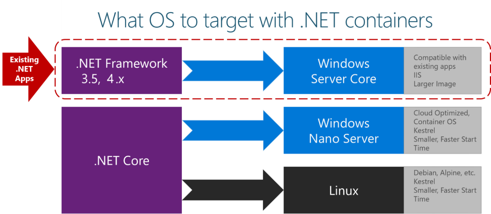

# 第9章 传统应用容器化实践

很多企业的业务应用都是跑在Java虚拟机之上的Java服务，为了更好的业务运行和业务资源调配能力，大量企业开始把原来的传统Java应用迁移到容器平台之上。在迁移到Docker容器过程中，很多用户发现Java并不能友好的支持容器技术的隔离特性，经常出现OOM，无法有效的隔离内存，用好物理内存。从我们用户的角度来说，我们期望JVM跑在容器中，应该是无感知的透明的使用环境的配置约定，但是JVM的兼容性还没有完全做好往往导致容器性能受到损失。这里最主要的问题是Java无法感知容器的存在，一切都是按照物理机的信息来支持Java虚拟机的环境。当我们使用容器来运行Java应用后，容器对CPU，内存的限制是无法直接告知JVM的，导致Java程序经常出现莫名的OOM Kill的问题。直到Java SE 8u131和Java 9版本发布开始，JVM才开始支持Cgroup参数的配置，这些Cgroup参数让Java程序可以感知容器分配的CPU资源和RAM资源。

## 9.1 Java 单体应用容器化

### 9.1.1 容器内存限制

在Java 10之前，JVM无法识别容器配置的内存限制和CPU使用限制，直到Java10开始，容器配置的内存限制可以自动加载到JVM中并执行。这里我们直观的使用Java8u1.6.2和Java10容器来详细查看Java对容器内存限制的差异，这里我们假设在一台2G内存和4个CPU的主机上运行：

```bash
$ docker container run -it -m256M --entrypoint bash openjdk:8

$ docker-java-home/bin/java -XX:+PrintFlagsFinal -version | grep MaxHeapSize
    uintx MaxHeapSize                              := 524288000                          {product}
openjdk version "1.8.0_162"
```

从Java 6开始，JVM定义了一个服务器标准配置定义，默认服务器应该提供2个CPU和2G内存大小，并且默认配置的堆栈大为物理内存的四分之一。以上例子中，虽然容器配置的256M内存限制，但是容器运行后，JVM仍然以宿主机的物理内存2G作为参考分配了四分之一512M内存作为堆栈大小，显然Java8u131之前并不支持容器的内存参数。作为对比的结果，我们可以看一下Java11版本的显示结果，堆栈内存被正确的配置为128M。

```text
$ docker container run -it -m512M --entrypoint bash openjdk:11-jdk
root@58e3e97ec2dd:/# docker-java-home/bin/java -XX:+PrintFlagsFinal -version | grep MaxHeapSize
   size_t MaxHeapSize                              = 134217728                                 {product} {ergonomic}
openjdk version "11.0.1" 2018-10-16
OpenJDK Runtime Environment (build 11.0.1+13-Debian-2bpo91)
OpenJDK 64-Bit Server VM (build 11.0.1+13-Debian-2bpo91, mixed mode, sharing)
```

### 9.1.2 容器CPU限制

通常情况下，我们不会给容器配置CPU限制，我们期望容器实例依赖主机CPU的调度来均衡CPU的使用。从Java 10开始已经可以识别容器配置的CPU共享限制参数如下：

```bash
root@ubuntu:~# docker container run -it --cpus 2 openjdk:11-jdk
Unable to find image 'openjdk:11-jdk' locally
11-jdk: Pulling from library/openjdk
Digest: sha256:5e48d6cda9b2e43c5b658f1c38e7bd38cd4b8933bf0074629edd974995cdfbd8
Status: Downloaded newer image for openjdk:11-jdk
Dec 27, 2018 1:02:52 PM java.util.prefs.FileSystemPreferences$1 run
INFO: Created user preferences directory.
|  Welcome to JShell -- Version 11.0.1
|  For an introduction type: /help intro

jshell> Runtime.getRuntime().availableProcessors()
$1 ==> 2
```

默认情况下主机里的所有容器共享CPU的时钟频率，但是你可以通过修改共享时钟频率的百分比来提高某一个容器对CPU的时钟占有率。这个默认时钟频率的百分比值是1024，你可以通过-c \(或--cpu-shares\)来配置一个值，这个值可以是1024的2倍或者数倍，这样就可以提高占用CPU资源的权重。这里配置的CPU使用权重只有在重度依赖CPU的进程运行的时候才会起作用，当容器内的进程进入休眠状态时，其他的主机进程还是会利用上闲置出来的CPU资源的。实际的CPU使用时间利用率依赖于主机上运行的容器数量和容器进程类型。

除了时钟频率的权重限制参数，还有CPU的完全公平调度算法的周期参数可以配置。比如我们假设一个容器一颗CPU的情况之下每50ms使用50%CPU运行资源，可以如下配置：

```bash
$ docker run -it --cpu-period=50000 --cpu-quota=25000 ubuntu:14.04 /bin/bash
```

这里1000为1ms，所以cpu-period配置了50ms，加上cpu-quota为25ms，所以就是50%的CPU运行资源。

除了cpu-shares，cpu-period，cpu-quota之外，还有一个重要的参数就是cpuset-cpus，它可以指定哪些CPU核来运行进程，如下：

```text
docker run -it --cpuset-cpus="1,2,3" openjdk:10-jdk
jshell> Runtime.getRuntime().availableProcessors()
$1 ==> 3
```

这里代表这个容器可以用到的CPU为3个，和配置的cpuset资源数一致。

### 9.1.3 JDK 支持容器技术版本对比

正是因为Java 10开始支持容器参数之后，我们在配置容器的时候，就不需要通过经验来猜测配置CPU和内存的容量大小。我们可以按照需求正确配置容器需要的CPU资源和内存资源，让Java程序更少的碰到OOM Killer问题。

| 参数/版本 | -XX:+UseCGroupMemoryLimitForHeap | -XX:ActiveProcessorCount | -XX:+UseContainerSupport |
| :--- | :--- | :--- | :--- |
| java8u131 | experimental，默认false | 无 | 无 |
| java9 | experimental，默认false | 无 | 无 |
| java10 | experimental，默认false | -1 | 无 |
| java11 | 移除 | -1 | product，默认true |

## 9.2 WebLogic 应用容器化

## 9.3 Windows .Net 应用容器化

Windows应用的容器化，主要是由微软提供技术支持并实现。考虑到Windows容器化的历程极其缓慢，其实这方面的容器化经验并不是很多。目前，容器化的场景焦点主要聚集在dotnet应用的迁移，如果需要构建原生windows应用，要求宿主机操作系统版本必须为windows 2016或者windows 10版本。借助于优秀的Docker Desktop for windows，开发者可以很容易进入容器化环境。在容器化镜像选择上，一般参考下图示例的策略来选择windows镜像：



### 9.3.1 ASP.NET Core容器化实践

对于早期的.net 2.x web应用，我们需要选择官方构建aspnet镜像作为基础镜像，并编写标准的**Dockerfile.window**构建脚本：



```bash
FROM mcr.microsoft.com/dotnet/core/aspnet:2.1.0
WORKDIR /dotnetapp
COPY out .
ENTRYPOINT ["dotnet", "dotnetapp.dll"]

```




因为微软Azure云提供了镜像注册表服务，所以，官方镜像已经统一更换地址如下：

之前使用microsoft/dotnet:2.1.0-runtime-deps，请替换为mcr.microsoft.com/dotnet/core/runtime-deps:2.1.0

之前使用microsoft/dotnet:2.1.0-runtime，请替换为mcr.microsoft.com/dotnet/core/runtime:2.1.0

之前使用microsoft/dotnet:2.1.0-aspnetcore-runtime，请替换为mcr.microsoft.com/dotnet/core/aspnet:2.1.0

之前使用microsoft/dotnet:2.1.300-sdk，请替换为mcr.microsoft.com/dotnet/core/sdk:2.1.300


针对dotnet的各种需求，微软提供的镜像分为 .NET Core Runtime 和 .NET Core SDK等多个分支版本。根据不同的依赖情况，读者需要自行选择合适的镜像作为运行时镜像。


