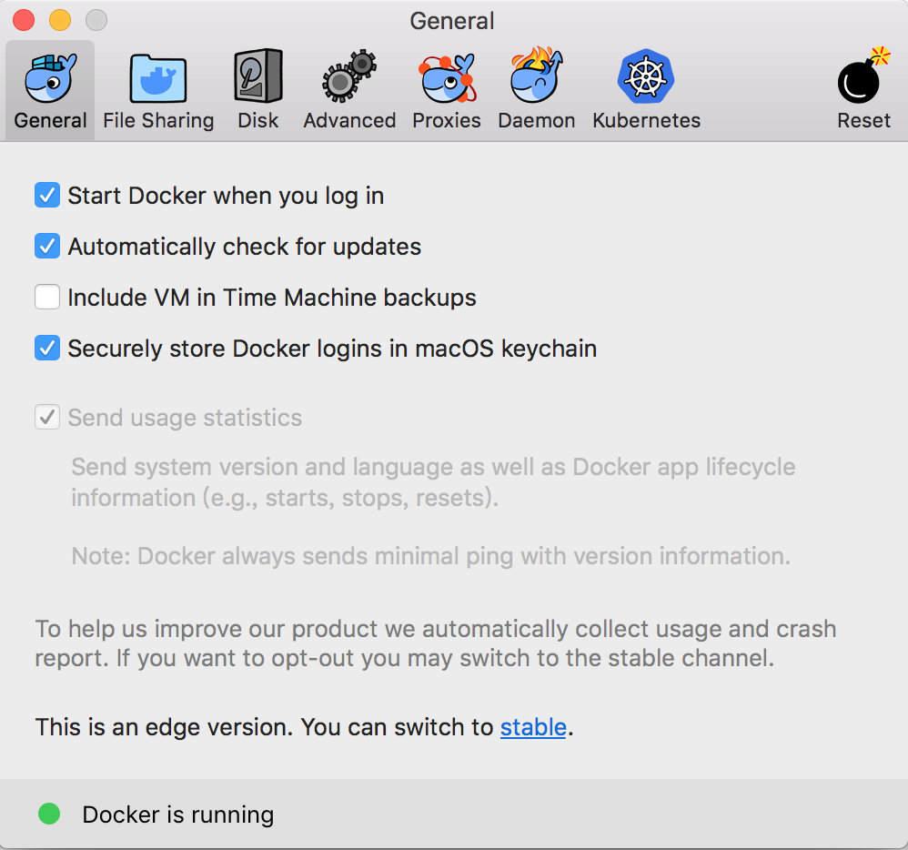

# 2. 玩转容器工具命令行

本章将给重点介绍容器命令行的概况。法国人所罗门\(**Solomon Hykes**\)是在PyCon 2013大会上第一次向开发者大众展示Docker工具的。新颖的应用容器启动概念快速在DevOps圈中获得关注并开始流行起来。随着云计算和DevOps技术的推波助澜，大量的容器应用实践也快速回馈到了Docker这个开源项目中，迅速让Docker成为云计算领域中最火热的一个开源项目。在经历了5年的磨砺之后，Docker工具链已经成为云计算工具链中最强大的底层系统工具之一，中国容器用户在整个容器演化历程中积累和总结了很多经验，读者通过本章的讲解可以达到融汇贯通Docker工具链并能应用在自己场景下的生产实践中。

随着容器技术的理解的深入，Docker工具安全性的潜在问题一直没有得到完美的解决。开源领域的先锋企业红帽带领社区推出了更安全的容器工具：Podman。在架构设计上采用fork/exec架构来取代Docker的client/server架构，这样的设计可以更安全的使用非root用户运行容器，容器运行起来后权限授权更精确合理，让容器里进程安全问题得到彻底解决。并且Podman在设计上就是要无缝替换Docker工具，所以它还能更好的支持OCI标准镜像和Pod容器的运行。在本章中我会通过实际的例子帮助读者理解和上手Podman。

## 1. 安装Docker命令行

当前Docker社区版本每个季度都会发布一个重要版本，工具的命令参数随着时间的推移常常让读者都搞不清楚到底有多少命令需要熟悉。所以，Docker推出了适合开发者使用的桌面版本安装包，支持MacOS和Windows两大主流操作系统平台，让用户可以随时接触Docker命令行工具的变化，从而达到教育用户的目的。



遗憾的事情是操作系统Linux、MacOS、Windows系统并不是一家公司发布的，Docker作为跨平台的系统工具想做到行为一致是异常艰难的事情。为了熟悉掌握Docker命令行参数和方法，通常选择的基准环境为Linux系统上的Docker工具。作为普通开发者，桌面版本的Docker工具也非常重要，Docker公司会把很多实验性的特性发布到桌面版本中，通过开发者的使用反馈来稳定容器特性，这是社区迭代开发中很流行的协作模式，让Docker工具在开发者社区得到广泛的普及。

接下来我们要做的事情就是安装一份正式版本的Docker引擎。由于开源Docker版本每个季度发布一个重要更新版本，服务器上Linux操作系统自带的Docker工具一般都是过时的软件，不推荐使用。为了安装最新版本的Docker，需要配置Docker官方的仓库地址，然后执行安装命令即可。这里的范例是在Ubuntu系统下安装Docker的步骤，请仔细查看：

```bash
$ sudo apt-get remove docker docker-engine docker.io
$ sudo apt-get update
$ sudo apt-get install \
    apt-transport-https \
    ca-certificates \
    curl \
    software-properties-common
$ curl -fsSL https://download.docker.com/linux/ubuntu/gpg | sudo apt-key add -
$ sudo add-apt-repository \
   "deb [arch=amd64] https://download.docker.com/linux/ubuntu \
   $(lsb_release -cs) \
   stable"
   
$ sudo apt-get update
$ sudo apt-get install docker-ce
```

安装完成之后，通常运行一个helloworld镜像来验证Docker引擎是否正确安装。

```bash
$ sudo docker run hello-world
```


由于Docker社区版本引擎更新频繁，Docker官方的安装文档是最佳的参考书，可以在第一时间查阅对应平台系统的安装步骤。例如[https://docs.docker.com/install/linux/docker-ce/ubuntu/](https://docs.docker.com/install/linux/docker-ce/ubuntu/#upgrade-docker-ce) 就是Ubuntu安装手册的地址。


## 2  解析Docker命令行

近些年容器技术变化巨大，熟悉Docker命令行工具的参数可以快速加深对容器技术的理解，所以先让我们一起开始一次真正的命令行学习之旅。首先，Docker的命令清单可以通过运行 **docker** ，或者 **docker help** 命令得到：

```bash
$ docker help                                                                                                                                                                     

Usage:  docker [OPTIONS] COMMAND

A self-sufficient runtime for containers

Options:
      --config string      Location of client config files (default "/Users/xiaods/.docker")                                                                                     
  -D, --debug              Enable debug mode
  -H, --host list          Daemon socket(s) to connect to
  -l, --log-level string   Set the logging level ("debug"|"info"|"warn"|"error"|"fatal") (default "info")                                                                        
      --tls                Use TLS; implied by --tlsverify
      --tlscacert string   Trust certs signed only by this CA (default "/Users/xiaods/.docker/ca.pem")                                                                           
      --tlscert string     Path to TLS certificate file (default "/Users/xiaods/.docker/cert.pem")                                                                               
      --tlskey string      Path to TLS key file (default "/Users/xiaods/.docker/key.pem")
      --tlsverify          Use TLS and verify the remote
  -v, --version            Print version information and quit

Management Commands:
  builder     Manage builds
  checkpoint  Manage checkpoints
  config      Manage Docker configs
  container   Manage containers
  image       Manage images
  network     Manage networks
  node        Manage Swarm nodes
  plugin      Manage plugins
  secret      Manage Docker secrets
  service     Manage services
  stack       Manage Docker stacks
  swarm       Manage Swarm
  system      Manage Docker
  trust       Manage trust on Docker images
  volume      Manage volumes

Commands:                                                                                                                                                                        
  attach      Attach local standard input, output, and error streams to a running container                                                                                      
  build       Build an image from a Dockerfile
  commit      Create a new image from a container's changes
  cp          Copy files/folders between a container and the local filesystem
  create      Create a new container
  deploy      Deploy a new stack or update an existing stack
  diff        Inspect changes to files or directories on a container's filesystem
  events      Get real time events from the server
  exec        Run a command in a running container
  export      Export a container's filesystem as a tar archive
  history     Show the history of an image
  images      List images
  import      Import the contents from a tarball to create a filesystem image
  info        Display system-wide information
  inspect     Return low-level information on Docker objects
  kill        Kill one or more running containers
  load        Load an image from a tar archive or STDIN
  login       Log in to a Docker registry
  logout      Log out from a Docker registry
  logs        Fetch the logs of a container
  pause       Pause all processes within one or more containers
  port        List port mappings or a specific mapping for the container
  ps          List containers
  pull        Pull an image or a repository from a registry
  push        Push an image or a repository to a registry
  rename      Rename a container
  restart     Restart one or more containers
  rm          Remove one or more containers
  rmi         Remove one or more images
  run         Run a command in a new container
  save        Save one or more images to a tar archive (streamed to STDOUT by default)
  search      Search the Docker Hub for images
  start       Start one or more stopped containers
  stats       Display a live stream of container(s) resource usage statistics
  stop        Stop one or more running containers
  tag         Create a tag TARGET_IMAGE that refers to SOURCE_IMAGE
  top         Display the running processes of a container
  unpause     Unpause all processes within one or more containers
  update      Update configuration of one or more containers
  version     Show the Docker version information
  wait        Block until one or more containers stop, then print their exit codes

Run 'docker COMMAND --help' for more information on a command.

```

在Docker容器技术不断演化的过程中，Docker的子命令已经达到41个之多，其中核心子命令\(例如：run\)还会有复杂的参数配置。笔者通过划分功能和应用场景方面的考虑，把命令行参数划分为4个部分，方便读者快速浏览Docker命令行的组成结构：

<table>
  <thead>
    <tr>
      <th style="text-align:center">功能划分</th>
      <th style="text-align:left">命令</th>
    </tr>
  </thead>
  <tbody>
    <tr>
      <td style="text-align:center">环境信息相关（2）</td>
      <td style="text-align:left">1. info 2. version</td>
    </tr>
    <tr>
      <td style="text-align:center">
        <p>系统运维相关</p>
        <p>（25）</p>
      </td>
      <td style="text-align:left">1. attach 2. build 3. commit 4. cp 5. diff 6. images 7. export/ import
        / save / load 8. inspect 9. kill 10. port 11. pause / unpause 12. ps 13.
        rm 14. rmi 15. run 16. start / stop / restart 17. tag 18. top 19.wait 20.
        rename 21.stats 22. update 23. exec 24.deploy 25.create</td>
    </tr>
    <tr>
      <td style="text-align:center">
        <p>日志信息相关</p>
        <p>（3）</p>
      </td>
      <td style="text-align:left">1. events 2. history 3. logs</td>
    </tr>
    <tr>
      <td style="text-align:center">
        <p>Docker 公有镜像仓库服务相关</p>
        <p>（3）</p>
      </td>
      <td style="text-align:left">1. login/ logout 2. pull / push 3. search</td>
    </tr>
  </tbody>
</table>### **2.1 参数约定**

单个字符的参数可以放在一起组合配置，例如

```bash
docker run -t -i --name test busybox sh 
```

可以用这样的方式等同：

```bash
docker run -ti --name test busybox sh
```

### **2.2 布尔值约定**

Boolean参数形式如： -d=false。注意，当你声明这个Boolean参数时，比如 docker run -d=true，它将直接把启动的Container挂起放在后台运行。

### **2.3 字符串和数字**

参数如 --name=“” 定义一个字符串，它仅能被定义一次。同类型的如-c=0 定义一个数字，它也只能被定义一次。

### **2.4 后台进程**

Docker后台进程是一个常驻后台的系统进程，目前已经从docker程序分离处理一份独立的程序dockerd来执行守护后台进程。这个后台进程是用来启动容器引擎的，使用dockerd --help可以得到更详细的功能参数配置, 如下所示：

```text
Usage:	dockerd COMMAND

A self-sufficient runtime for containers.

Options:
      --add-runtime runtime                   Register an additional OCI compatible runtime (default [])
      --allow-nondistributable-artifacts list Push nondistributable artifacts to specified registries (default [])
      --api-cors-header string                Set CORS headers in the Engine API
      --authorization-plugin list             Authorization plugins to load (default [])
      --bip string                            Specify network bridge IP
  -b, --bridge string                         Attach containers to a network bridge
      --cgroup-parent string                  Set parent cgroup for all containers
      --cluster-advertise string              Address or interface name to advertise
      --cluster-store string                  URL of the distributed storage backend
      --cluster-store-opt map                 Set cluster store options (default map[])
      --config-file string                    Daemon configuration file (default "/etc/docker/daemon.json")
      --containerd string                     Path to containerd socket
      --cpu-rt-period int                     Limit the CPU real-time period in microseconds
      --cpu-rt-runtime int                    Limit the CPU real-time runtime in microseconds
      --data-root string                      Root directory of persistent Docker state (default "/var/lib/docker")
  -D, --debug                                 Enable debug mode
      --default-gateway ip                    Container default gateway IPv4 address
      --default-gateway-v6 ip                 Container default gateway IPv6 address
      --default-runtime string                Default OCI runtime for containers (default "runc")
      --default-ulimit ulimit                 Default ulimits for containers (default [])
      --disable-legacy-registry               Disable contacting legacy registries (default true)
      --dns list                              DNS server to use (default [])
      --dns-opt list                          DNS options to use (default [])
      --dns-search list                       DNS search domains to use (default [])
      --exec-opt list                         Runtime execution options (default [])
      --exec-root string                      Root directory for execution state files (default "/var/run/docker")
      --experimental                          Enable experimental features
      --fixed-cidr string                     IPv4 subnet for fixed IPs
      --fixed-cidr-v6 string                  IPv6 subnet for fixed IPs
  -G, --group string                          Group for the unix socket (default "docker")
      --help                                  Print usage
  -H, --host list                             Daemon socket(s) to connect to (default [])
      --icc                                   Enable inter-container communication (default true)
      --init                                  Run an init in the container to forward signals and reap processes
      --init-path string                      Path to the docker-init binary
      --insecure-registry list                Enable insecure registry communication (default [])
      --ip ip                                 Default IP when binding container ports (default 0.0.0.0)
      --ip-forward                            Enable net.ipv4.ip_forward (default true)
      --ip-masq                               Enable IP masquerading (default true)
      --iptables                              Enable addition of iptables rules (default true)
      --ipv6                                  Enable IPv6 networking
      --label list                            Set key=value labels to the daemon (default [])
      --live-restore                          Enable live restore of docker when containers are still running
      --log-driver string                     Default driver for container logs (default "json-file")
  -l, --log-level string                      Set the logging level ("debug", "info", "warn", "error", "fatal") (default "info")
      --log-opt map                           Default log driver options for containers (default map[])
      --max-concurrent-downloads int          Set the max concurrent downloads for each pull (default 3)
      --max-concurrent-uploads int            Set the max concurrent uploads for each push (default 5)
      --metrics-addr string                   Set default address and port to serve the metrics api on
      --mtu int                               Set the containers network MTU
      --no-new-privileges                     Set no-new-privileges by default for new containers
      --oom-score-adjust int                  Set the oom_score_adj for the daemon (default -500)
  -p, --pidfile string                        Path to use for daemon PID file (default "/var/run/docker.pid")
      --raw-logs                              Full timestamps without ANSI coloring
      --registry-mirror list                  Preferred Docker registry mirror (default [])
      --seccomp-profile string                Path to seccomp profile
      --selinux-enabled                       Enable selinux support
      --shutdown-timeout int                  Set the default shutdown timeout (default 15)
  -s, --storage-driver string                 Storage driver to use
      --storage-opt list                      Storage driver options (default [])
      --swarm-default-advertise-addr string   Set default address or interface for swarm advertised address
      --tls                                   Use TLS; implied by --tlsverify
      --tlscacert string                      Trust certs signed only by this CA (default "~/.docker/ca.pem")
      --tlscert string                        Path to TLS certificate file (default "~/.docker/cert.pem")
      --tlskey string                         Path to TLS key file (default ~/.docker/key.pem")
      --tlsverify                             Use TLS and verify the remote
      --userland-proxy                        Use userland proxy for loopback traffic (default true)
      --userland-proxy-path string            Path to the userland proxy binary
      --userns-remap string                   User/Group setting for user namespaces
  -v, --version   
```

Docker后台进程参数清单如下表：

| 参数 | 解释 |
| :--- | :--- |
| --add-runtime runtime | 选择容器运行时引擎，默认containerd |
| --allow-nondistributable-artifacts list | 因为类如window base image包含版权限制，所以配置指定的私有镜像仓库，可以帮助应用正常发布 |
| --api-cors-header string | 提供跨站API请求自定义包头信息 |
| --authorization-plugin list | 认证插件配置 |
| --bip string | 配置网桥地址 |
| -b, --bridge string | 连接网桥 |
| --cgroup-parent string | 配置容器的父cgroup信息 |
| --cluster-advertise string | 集群广播网络地址 |
| --cluster-store string | 集群存储支持 |
| --cluster-store-opt map | 集群存储参数配置 |
| --config-file string | 后台引擎参数配置文件 |
| --containerd string | 容器引擎实例网络套接字路径 |
| --cpu-rt-period int | 限制CPU间隔频率（微秒级别） |
| --cpu-rt-runtime int | 限制CPU运行时频率（微秒级别） |
| --data-root string | 容器引擎数据根目录地址 |
| -D, --debug | 调试信息 |
| --default-gateway ip | 容器默认ipv4网络网关 |
| --default-gateway-v6 ip | 容器默认ipv6网络网关 |
| --default-runtime string | 容器运行时，默认runc |
| --default-ulimit ulimit | 配置容器默认最大文件限制数，改善运行性能 |
| --disable-legacy-registry | 废弃老版本镜像仓库 |
| --dns list | DNS服务地址 |
| --dns-opt list | DNS服务参数 |
| --dns-search list | DNS服务查询域名配置 |
| --exec-opt list | 运行时执行参数 |
| --exec-root string | 运行时执行根目录地址 |
| --experimental | 启用实验性特性 |
| --fixed-cidr string | 固定IPv4网段 |
| --fixed-cidr-v6 string | 固定IPv6网段 |
| -G, --group string | 网络套接字所属组 |
| --help | 帮助信息 |
| -H, --host list | 后台进程连接地址 |
| --icc | 启用容器间的网络互联，默认启用 |
| --init | 在容器运行时启动一个init程序，来统一管理进程 |
| --init-path string | docker init的路径地址 |
| --insecure-registry list | 非安全镜像仓库地址列表 |
| --ip ip | 默认容器绑定IP地址，默认0.0.0.0 |
| --ip-forward | 启动net.ipv4.ip\_forward |
| --ip-masq | 启动IP混淆 |
| --iptables | 启动默认的iptable规则 |
| --ipv6 | 启动ipv6网络 |
| --label list | 配置键值对参数到引擎后台 |
| --live-restore | 启用容器热迁移特性 |
| --log-driver string | 日志驱动配置，默认json-file |
| -l, --log-level string | 日志级别 |
| --log-opt map | 日志驱动参数 |
| --max-concurrent-downloads int | 每次pull的最大下载线程数 |
| --max-concurrent-uploads int | 每次push最大上传线程数 |
| --metrics-addr string | 监控地址 |
| --mtu int | 网络数据包MTU配置 |
| --no-new-privileges | 去掉 no\_new\_privs权限 |
| --oom-score-adjust int | OOM阈值配置 |
| -p, --pidfile string | 引擎后台进程文件地址 |
| --raw-logs | 无ANSI颜色的日志 |
| --registry-mirror list | 镜像仓库同步镜像地址 |
| --seccomp-profile string | seccomp文件地址 |
| --selinux-enabled | 启用selinux |
| --shutdown-timeout int | 默认停机超时时间，默认15秒 |
| -s, --storage-driver string | 容器存储驱动 |
| --storage-opt list | 容器存储驱动参数 |
| --swarm-default-advertise-addr string | swarm集群广播地址 |
| --tls | 使用TLS认证 |
| --tlscacert string | CA文件地址 |
| --tlscert string | TLS认证文件地址 |
| --tlskey string | TLS私钥地址 |
| --tlsverify | 使用TLS认证 |
| --userland-proxy | 使用用户态proxy来路由loopback流量 |
| --userland-proxy-path string | 用户态proxy地址 |
| --userns-remap string | 用户命令空间的用户、用户组配置 |
| -v, --version | 版本 |

## 3. 探秘Docker命令行

### **3.1 环境信息相关**

**info**

使用方法： docker info

例子：

```text
[fedora@docker-devel-cli docker]$ sudo docker -D info
Containers: 0
Images: 32
Storage Driver: devicemapper
 Pool Name: docker-252:1-130159-pool
 Data file: /var/lib/docker/devicemapper/devicemapper/data
 Metadata file: /var/lib/docker/devicemapper/devicemapper/metadata
 Data Space Used: 1616.9 Mb
 Data Space Total: 102400.0 Mb
 Metadata Space Used: 2.4 Mb
 Metadata Space Total: 2048.0 Mb
Execution Driver: native-0.2
Kernel Version: 3.11.10-301.fc20.x86_64
Debug mode (server): false
Debug mode (client): true
Fds: 11
Goroutines: 14
EventsListeners: 0
Init SHA1: 2c5adb59737b8a01fa3fb968519a43fe140bc9c9
Init Path: /usr/libexec/docker/dockerinit
Sockets: [fd://]
```

使用说明：

这个命令在开发者报告Bug时会非常有用，结合docker vesion一起，可以随时使用这个命令把本地的配置信息提供出来，方便Docker的开发者快速定位问题。

**version**

使用方法： docker version

使用说明：

显示Docker的版本号，API版本号，Git commit， Docker客户端和后台进程的Go版本号。

### **3.2 系统运维相关**

**attach**

使用方法： docker attach \[OPTIONS\] CONTAINER

例子：

```text
$ ID=$(sudo docker run -d ubuntu /usr/bin/top -b)
$ sudo docker attach $ID
top - 17:21:49 up  5:53,  0 users,  load average: 0.63, 1.15, 0.78
Tasks:   1 total,   1 running,   0 sleeping,   0 stopped,   0 zombie
%Cpu(s):  1.0 us,  0.7 sy,  0.0 ni, 97.7 id,  0.7 wa,  0.0 hi,  0.0 si,  0.0 st
KiB Mem:   2051644 total,   723700 used,  1327944 free,    33032 buffers
KiB Swap:   0 total,   0 used,  0 free.   565836 cached Mem
​
  PID USER      PR  NI    VIRT    RES    SHR S %CPU %MEM     TIME+ COMMAND
    1 root      20   0   19748   1280   1008 R  0.0  0.1   0:00.04 top
$ sudo docker stop $ID
```

使用说明：

使用这个命令可以挂载正在后台运行的容器，在开发应用的过程中运用这个命令可以随时观察容器內进程的运行状况。开发者在开发应用的场景中，这个命令是一个非常有用的命令。

**build**

使用方法：docker build \[OPTIONS\] PATH \| URL \| -

例子：

```text
$ docker build .
Uploading context 18.829 MB
Uploading context
Step 0 : FROM busybox
 ---> 769b9341d937
Step 1 : CMD echo Hello world
 ---> Using cache
 ---> 99cc1ad10469
Successfully built 99cc1ad10469
```

使用说明：

这个命令是从源码构建新Image的命令。因为Image是分层的，最关键的Base Image是如何构建的是用户比较关心的，Docker官方文档给出了构建方法，请参考[这里](https://docs.docker.com/engine/userguide/eng-image/baseimages/)。

**commit**

使用方法：docker commit \[OPTIONS\] CONTAINER \[REPOSITORY\[:TAG\]\]

例子：

```text
$ sudo docker ps
ID                  IMAGE               COMMAND             CREATED             STATUS              PORTS
c3f279d17e0a        ubuntu:12.04        /bin/bash           7 days ago          Up 25 hours
197387f1b436        ubuntu:12.04        /bin/bash           7 days ago          Up 25 hours
$ docker commit c3f279d17e0a  SvenDowideit/testimage:version3
f5283438590d
$ docker images | head
REPOSITORY                        TAG                 ID                  CREATED             VIRTUAL SIZE
SvenDowideit/testimage            version3            f5283438590d        16 seconds ago      335.7 MB
```

使用说明：

这个命令的用处在于把有修改的container提交成新的Image，然后导出此Imange分发给其他场景中调试使用。Docker官方的建议是，当你在调试完Image的问题后，应该写一个新的Dockerfile文件来维护此Image。commit命令仅是一个临时创建Imange的辅助命令。

**cp**

使用方法： cp CONTAINER:PATH HOSTPATH

使用说明：

使用cp可以把容器內的文件复制到Host主机上。这个命令在开发者开发应用的场景下，会需要把运行程序产生的结果复制出来的需求，在这个情况下就可以使用这个cp命令。

**diff**

使用方法：docker diff CONTAINER

例子：

```text
$ sudo docker diff 7bb0e258aefe
​
C /dev
A /dev/kmsg
C /etc
A /etc/mtab
A /go
A /go/src
A /go/src/github.com
A /go/src/github.com/dotcloud
....
```

使用说明：

diff会列出3种容器内文件状态变化（A - Add, D - Delete, C - Change ）的列表清单。构建Image的过程中需要的调试指令。

**images**

使用方法：docker images OPTIONS

例子：

```text
$ sudo docker images | head
REPOSITORY TAG IMAGE ID CREATED VIRTUAL SIZE
<none> <none> 77af4d6b9913 19 hours ago 1.089 GB
committest latest b6fa739cedf5 19 hours ago 1.089 GB
<none> <none> 78a85c484f71 19 hours ago 1.089 GB
$ docker latest 30557a29d5ab 20 hours ago 1.089 GB
<none> <none> 0124422dd9f9 20 hours ago 1.089 GB
<none> <none> 18ad6fad3402 22 hours ago 1.082 GB
<none> <none> f9f1e26352f0 23 hours ago 1.089 GB
tryout latest 2629d1fa0b81 23 hours ago 131.5 MB
<none> <none> 5ed6274db6ce 24 hours ago 1.089 GB
```

使用说明：

Docker Image是多层结构的，默认只显示最顶层的Image。不显示的中间层默认是为了增加可复用性、减少磁盘使用空间，加快build构建的速度的功能，一般用户不需要关心这个细节。

**export/ import / save / load**

使用方法：

```text
docker export red_panda > latest.tar
docker import URL|- [REPOSITORY[:TAG]]
docker save IMAGE
docker load
```

使用说明：

这一组命令是系统运维里非常关键的命令。加载\(两种方法: import，load\)，导出\(一种方法: save，export\)容器系统文件。

**inspect**

使用方法：

```text
docker inspect CONTAINER|IMAGE [CONTAINER|IMAGE...]
```

例子：

```text
$ sudo docker inspect --format='{{.NetworkSettings.IPAddress}}' $INSTANCE_ID
```

使用说明：

查看容器运行时详细信息的命令。了解一个Image或者Container的完整构建信息就可以通过这个命令实现。

**kill**

使用方法：

```text
docker kill [OPTIONS] CONTAINER [CONTAINER...]
```

使用说明：

杀掉容器的进程。

**port**

使用方法：

```text
docker port CONTAINER PRIVATE_PORT
```

使用说明：

打印出Host主机端口与容器暴露出的端口的NAT映射关系

**pause / unpause**

使用方法：

```text
docker pause CONTAINER
```

使用说明：

使用cgroup的freezer顺序暂停、恢复容器里的所有进程。详细freezer的特性，请参考[官方文档](https://www.kernel.org/doc/Documentation/cgroup-v1/freezer-subsystem.txt)。

**ps**

使用方法：

```text
docker ps [OPTIONS]
```

例子：

```text
$ docker ps
CONTAINER ID        IMAGE                        COMMAND                CREATED              STATUS              PORTS               NAMES
4c01db0b339c        ubuntu:12.04                 bash                   17 seconds ago       Up 16 seconds                           webapp
d7886598dbe2        crosbymichael/redis:latest   /redis-server --dir    33 minutes ago       Up 33 minutes       6379/tcp            redis,webapp/db
```

使用说明：

docker ps打印出正在运行的容器，docker ps -a打印出所有运行过的容器。

**rm**

使用方法：

```text
docker rm [OPTIONS] CONTAINER [CONTAINER...]
```

例子：

```text
$ sudo docker rm /redis
/redis
```

使用说明：

删除指定的容器。

**rmi**

使用方法：

```text
docker rmi IMAGE [IMAGE...]
```

例子：

```text
$ sudo docker images
REPOSITORY TAG IMAGE ID CREATED SIZE
test1 latest fd484f19954f 23 seconds ago 7 B (virtual 4.964 MB)
test latest fd484f19954f 23 seconds ago 7 B (virtual 4.964 MB)
test2 latest fd484f19954f 23 seconds ago 7 B (virtual 4.964 MB)
​
$ sudo docker rmi fd484f19954f
Error: Conflict, cannot delete image fd484f19954f because it is tagged in multiple repositories
2013/12/11 05:47:16 Error: failed to remove one or more images
​
$ sudo docker rmi test1
Untagged: fd484f19954f4920da7ff372b5067f5b7ddb2fd3830cecd17b96ea9e286ba5b8
​
$ sudo docker rmi test2
Untagged: fd484f19954f4920da7ff372b5067f5b7ddb2fd3830cecd17b96ea9e286ba5b8
​
$ sudo docker images
REPOSITORY TAG IMAGE ID CREATED SIZE
test latest fd484f19954f 23 seconds ago 7 B (virtual 4.964 MB)
​
$ sudo docker rmi test
Untagged: fd484f19954f4920da7ff372b5067f5b7ddb2fd3830cecd17b96ea9e286ba5b8
Deleted: fd484f19954f4920da7ff372b5067f5b7ddb2fd3830cecd17b96ea9e286ba5b8
```

使用说明：

指定删除Image文件。

**run**

使用方法：

```text
docker run [OPTIONS] IMAGE [COMMAND] [ARG...]
```

例子：

```text
$ sudo docker run --cidfile /tmp/docker_test.cid ubuntu echo "test"
```

使用说明：

这个命令是核心命令，可以配置的子参数详细解释可以通过docker run --help列出。

**start / stop / restart**

使用方法：

```text
docker start CONTAINER [CONTAINER...]
```

使用说明：

这组命令可以开启\(两个：start, restart\)，停止\(一个：stop\)一个容器。

**tag**

使用方法：

```text
docker tag [OPTIONS] IMAGE[:TAG] [REGISTRYHOST/][USERNAME/]NAME[:TAG]
```

使用说明：

组合使用用户名，Image名字，标签名来组织管理Image。

**top**

使用方法：

```text
docker top CONTAINER [ps OPTIONS]
```

使用说明：

显示容器內运行的进程。

**wait**

使用方法：

```text
docker wait CONTAINER [CONTAINER...]
```

使用说明：

阻塞对指定容器的其他调用方法，直到容器停止后退出阻塞。

**rename**

使用方法：

```text
docker rename CONTAINER NEW_NAME
```

使用说明：

重新命名一个容器

**stats**

使用方法：

```text
docker stats [OPTIONS] [CONTAINER...]
```

使用说明：

实时显示容器资源使用监控指标

**update**

使用方法：

```text
docker update [OPTIONS] CONTAINER [CONTAINER...]
```

使用说明：

更新一或多个容器实例的IO、CPU、内存，启动策略参数

**exec**

使用方法：

```text
docker exec [OPTIONS] CONTAINER COMMAND [ARG...]
```

使用说明：

在运行中容器中运行命令

**deploy**

使用方法：

```text
docker deploy [OPTIONS] STACK
```

使用说明：

部署新的stack文件，两种格式DAB格式和Compose格式，当前使用趋势来看，Compose成为默认标准。

**create**

使用方法：

```text
docker create [OPTIONS] IMAGE [COMMAND] [ARG...]
```

使用说明：

这是一个重要的命令，可以创建容器但并不执行它。

### **3.3 日志信息相关**

**events**

使用方法：

```text
docker events [OPTIONS]
```

使用说明：

打印容器实时的系统事件。

**history**

使用方法：

```text
docker history [OPTIONS] IMAGE
```

例子：

```text
$ docker history docker
IMAGE CREATED CREATED BY SIZE
3e23a5875458790b7a806f95f7ec0d0b2a5c1659bfc899c89f939f6d5b8f7094 8 days ago 
/bin/sh -c #(nop) ENV LC_ALL=C.UTF-8 0 B
8578938dd17054dce7993d21de79e96a037400e8d28e15e7290fea4f65128a36 8 days ago 
/bin/sh -c dpkg-reconfigure locales && locale-gen C.UTF-8 && 
/usr/sbin/update-locale LANG=C.UTF-8 1.245 MB
be51b77efb42f67a5e96437b3e102f81e0a1399038f77bf28cea0ed23a65cf60 8 days ago /bin/sh 
-c apt-get update && apt-get install -y git libxml2-dev python build-essential 
make gcc python-dev locales python-pip 338.3 MB
4b137612be55ca69776c7f30c2d2dd0aa2e7d72059820abf3e25b629f887a084 6 weeks ago 
/bin/sh -c #(nop) ADD jessie.tar.xz in / 121 MB
750d58736b4b6cc0f9a9abe8f258cef269e3e9dceced1146503522be9f985ada 6 weeks ago 
/bin/sh -c #(nop) MAINTAINER Tianon Gravi <admwiggin@gmail.com>
 - mkimage-debootstrap.sh -t jessie.tar.xz jessie http://http.debian.net/debian 0 B
511136ea3c5a64f264b78b5433614aec563103b4d4702f3ba7d4d2698e22c158 9 months ago 0 B
```

使用说明：

打印指定Image中每一层Image命令行的历史记录。

**logs**

使用方法：

```text
docker logs CONTAINER
```

使用说明：

批量打印出容器中进程的运行日志。

**2.4 Dcoker Hub服务相关**

**login/ logout**

使用方法：

```text
docker login [OPTIONS] [SERVER]
docker logout [SERVER]
```

使用说明：

登录登出Docker Hub服务。

**pull / push**

使用方法：

```text
docker push NAME[:TAG]
```

使用说明：

通过此命令分享Image到Hub服务或者自服务的Registry服务。

**search**

使用方法：

```text
docker search TERM
```

使用说明：

通过关键字搜索分享的Image。

## 4. 更安全的命令行Podman

为了安全的运行容器，容器社区在红帽的推动下发布了更安全的容器工具集合：Podman、runc、systemd、Buildah、skopeo。Podman的目标就是无缝替换Docker，并且更安全。为了体验容器的安全问题，这里需要先了解下Linux Kernel有一个系统工具audit，可以实时监控系统上的安全事件，并把日志保存在日志audit.log中。例如，为了监测系统文件/etc/shadow是否有修改的情况，可以执行以下命令：

```bash
# auditctl -w /etc/shadow
```

然后故意的修改系统文件/etc/shadow，并同时查看audit.log如下：

```bash
# touch /etc/shadow
# ausearch -f /etc/shadow -i -ts recent

type=PROCTITLE msg=audit(10/10/2018 09:46:03.042:4108) : proctitle=touch /etc/shadow
type=SYSCALL msg=audit(10/10/2018 09:46:03.042:4108) : arch=x86_64 syscall=openat
success=yes exit=3 a0=0xffffff9c a1=0x7ffdb17f6704 a2=O_WRONLY|O_CREAT|O_NOCTTY|
O_NONBLOCK a3=0x1b6 items=2 ppid=2712 pid=3727 auid=dwalsh uid=root gid=root
euid=root suid=root fsuid=root egid=root sgid=root fsgid=root tty=pts1 ses=3 comm=touch
exe=/usr/bin/touch subj=unconfined_u:unconfined_r:unconfined_t:s0-s0:c0.c1023 key=(null)
```

audit审计的信息很多，其中**auid=dwalsh**代表修改此/etc/shadow文件的进程所有者是**dwalsh**。Linux Kernel在用户登录的同时，会在系统文件**/proc/self/loginuid**中记录**loginuid**，也就是用户登录ID。示例如下：

```text
$ cat /proc/self/loginuid
3267
```

即使切换成root，系统仍然知道还是**dwalsh**这个用户在修改文件。

```text
$ sudo cat /proc/self/loginuid
3267
```

注意每一个进程从最初的登录进程分叉出来，都会继承loginuid, 所以系统知道dwalsh这个用户修改的文件。

接下来，如果是使用Podman或者Docker，loginuid还会一样吗？

```bash
sudo podman run fedora cat /proc/self/loginuid
3267
```

而Docker执行结果如下：

```bash
sudo docker run fedora cat /proc/self/loginuid
4294967295
```

从示例中我们可以看到Podman和系统进程的行为一致，更安全可控。


Podman采用经典的进程模型fork/exec启动容器，容器都是Podman进程的子孙。而Docker采用client/server进程模型运行容器。Docker采用**docker**命令发出指令给Docker后台进程，然后Docker后台程序通过stdin/stdout通道把容器运行信息返回给docker命令行。因为Docker后台进程是init系统的子孙进程，所以才显示的是长串的id字符串：4294967295。可以用如下命令验证：

```bash
cat /proc/1/loginuid
4294967295
```


## 5. 总结

通过以上对Docker命令行的详细解释，读者可以强化对Docker命令的熟悉。尽管本章详细介绍了Docker方方面面的命令行参数，但仍然是重点参数的介绍。考虑到Docker的版本迭代快，很多社区实践很快就进入到新版本的参数列表中，为了确保参数使用正确，请随时参考Docker官方文档获得最全面的解释定义。

另外在整理分析Docker命令行的过程中，笔者发现Docker在实现引擎的架构中，以一套API为参考标准，服务端和客户端实现完全以API为基础，重用大量实现设计，通过一套代码实现容器的核心技术。在文件结构式，命令行可执行代码仅仅为一个二进制文件。这种命令行架构设计优雅的解决了前后端逻辑的实现复杂度，非常值得开发类似系统命令行工具的开发者参考应用。


Docker官方文档（[https://docs.docker.com](https://docs.docker.com)）是Docker公司提供给用户的最全面的Docker引擎使用手册，很多对容器技术的定义和最佳实践都来自这里。


